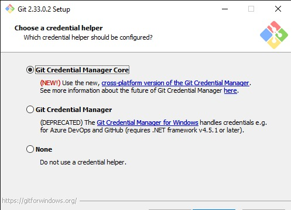

# 01-git-github

Langkah-langkah instalasi Git pada windows
1. Mendownlod Git pada website https://www.git-scm.com/

2. Jika sudah selesai mendownload, klik setup aplikasi maka akan muncul lisensi dari Git kemudian pilih next

3. Kemudian akan muncul pilihan untuk menetukan lokasi instalasi, bisa memilih local C atau jika ingin di simpan pada tempat lain bisa pilih browser, lalu pilih next

4. Kemudian akan muncul komponen tambahan apa saja, bisa di biarkan default saja langsung pilih next

5. Selajutnya akan muncul select start menu folder yang di gunakan untuk mengubah nama atau di biarkan seperti default kemudan pilih next

6. Memilih file editor yang akan digunakan, bisa menggunakan notepad++ seperti pada default atau menggunakan file editor lain seperti visual studio code, kemudian pilih next

7. Mengatur path environment, pilih git form the command and aslo from 3-rd party software agar cmd dapat mengenali perintah git. kemudian klik next

8. Pilih OpenSLL library kemudian pilih next

9. Memilih line ending, pilih checkout windows-style, commit unix-style line endings, kemudian pilih next

10. Memilih terminal emulator untuk mengakses ke Git Bash. pilih yang use MinTTY (the default terminal of MSYS2). kemudian pilih next

11. Pada mengatur opsi extra pilih enable file system caching dan enable git credential manager. kemudian pilih install

12. Setelah itu proses instalasi akan berlangsung. kemudian setelah selesai pilih finsih.

Konfigurasi Git

- Pertama-tama buka Git Bash

- Kemudian ketikan 

$ git config --global user.name "username di Github"

$ git config --global user.email alamatemail@gmail.com

$ git config --list

Mengolah repo sendiri

1. pilih tanda + pada pojok kanan atas kemudian pilih new repository

2. Kemudian isikan repository name, untuk description bisa di biarkan kosong kemudian pilih public atau public

3. Kemudian untuk initialize this repository with bisa di biarkan kosong saja kemudian langsung pilih create repsitory

4. Kemudian untuk menambahkan folder, pilih klik kanan kemudian add git bash here

5. Setelah itu ketikan git echo "# 01-git-github" >> README.md

Melakukan push
- klik kanan kemudian pilih git bash here

- kemudian ketikan git status untuk mengecek status pada folder

- kemudian ketikan git add README.md untuk menambahkan file README.md

- setelah itu ketikan git add img (nama folder foto yang digunakan)

- selanjutnya ketikan git -m "frist commit"

- terakhir ketikan git push

- kemudian cek kembali pada akun github akan muncul data tersebut

Melakukan clone
- klik kanan pada folder dimana pun yang di inginkan untuk menyimpan file yang akan di clone

- kemudian ketikan git clone dan link dari folder github pada git bash here

- kemdian cek kembali pada local disk atau folder yang akan di gunakan untuk menyimpan

